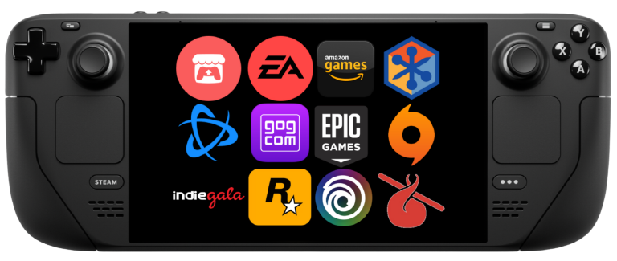

  

# NonSteamLaunchers 🚀

This script installs the latest GE-Proton, installs Non-Steam-Launchers under one unique Proton prefix folder in your compatdata folder path called "NonSteamLaunchers" and adds them to your Steam Library. 
So you can use them on Desktop or in Game Mode.

## Usage 🎮
Go to your desktop, click the NonSteamLaunchers icon, it will download and run the latest NonSteamLaunchers.sh from this repository and run it. 
You will simply have to choose which launcher to install and let the script handle the rest. 💻 No files are left in your "Downloads" they are deleted after installation.

After running the script, launch Steam on your Steam Deck. You'll find the new launchers in your library under the non-steam tab. Click a launcher to see your installed games from that store, and launch them directly from Steam! Even in gamemode 🥳
## Installation Instructions🔧
Go to desktop mode, right click [HERE](https://github.com/moraroy/NonSteamLaunchers-On-Steam-Deck/raw/main/NonSteamLaunchers.desktop) and save the .desktop file to your Steam Deck desktop. 

## Installation Tutorials 📖
[@SteamDeckGaming](https://www.youtube.com/@SteamDeckGaming) - YouTube Tutorial
[https://www.youtube.com/watch?v=uYWNZGiBsUo](https://youtu.be/svOj4MTEAVc)

[@SteamDeckGaming](https://www.steamdeckgaming.net) - Article
https://www.steamdeckgaming.net/post/easy-launchers-install-on-steam-deck

## Supported Stores 🛍
- Battle.net ✔️
- Epic Games ✔️
- GOG Galaxy ✔️
- Origin (only working way) ✔️
- Ubisoft ✔️
- EA App ✔️
- Amazon Games Launcher ✔️
- Itch.io ✔️
- Legacy Games ✔️
- Humble Games Collection ✔️
- IndieGala ✔️
- Rockstar Games Launcher ✔️

## MicroSD Support 💾
This script supports moving the entire prefix to a microSD.
The script will install launchers and games to your SD card, and the launchers in Steam will point to the SD card installation. This allows you to save internal storage space on your Steam Deck!

## Currently Working On 👷‍♂️

- Decky Loader Plugin ❌ 
 
#

### Contributing 🤝

If you have any suggestions or improvements for this script, feel free to open an issue or submit a pull request.

### 📝 License

This project is licensed under the MIT License. See the `LICENSE` file for more information.
